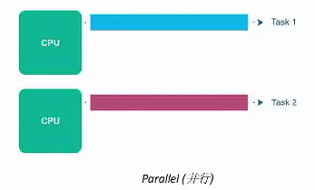
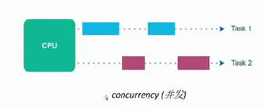

# 并行处理简介

## 穿行处理与并行处理的区别
### 串行
- 指令、代码依次执行；
- 前一条指令执行结束才能执行下一条指令；
- 一般来说，当程序有数据依赖或者分支等这些情况需要进行串行处理；

```C++
/*
数据依赖
*/
a = b + c;
d = b + a;
```
```C++
//分支
if(a==b){
    c =d;
}else{
    c =a;
}

```
- 使用场景
  复杂的逻辑计算场景（操作系统等）

例如：->state1->state2->state3->state4->state5····

对上述执行进行优化,优化策略如下：

1. 把没有数据依赖的代码分配到各个的core各自执行（调度）；
2. 将一个大的loop分解成多个小块代码，分配到各个core中进行执行；
3. 如果另一个程序已经得到数据则提前执行该程序以减少等待时间；

上述优化过程可以利用多核多线程（并行程序）。

### 并行（Parallel Process）

- 指令/代码块同时执行；
- 充分利用多核的特性，多个core仪器去完成一个或者多个任务；
- 使用场景：科学计算、图像处理、深度学习等等；
  
“并行与并发的区别”:

- 并行（parallel）物理意义上同时执行，如下图所示：

- 并发（concurrent）逻辑意义上同时执行，如下图所示：
  
  


