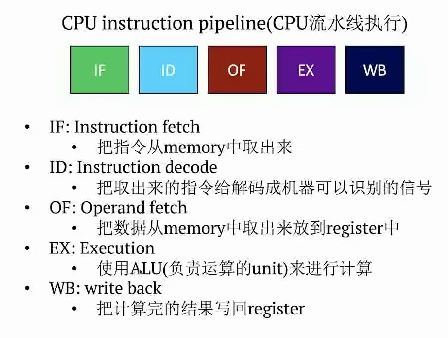
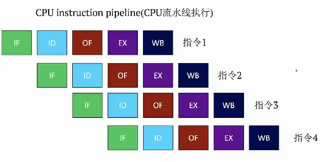
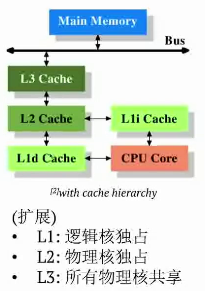
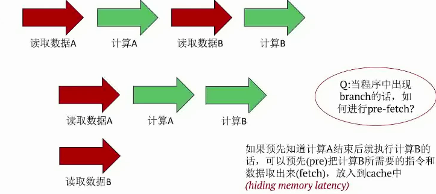
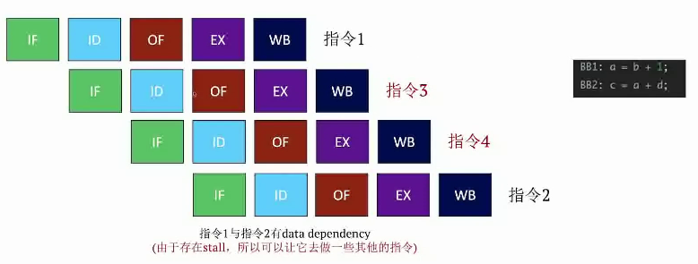

## GOAL：主要理解GPU并行处理与CPU并行处理上的不同，以及影响并行处理的基本因素

### 英语单词拓展
- lantency：完成一个指令所需要的时间
- memeory latency：CPU/GPU从内存中获取数据所需要的等待时间；CPU并行处理优化的主要方向
- throughput（吞吐量）：单位时间内可以执行的指令数；GPU并行处理优化的主要方向
- Multi-threaing：多线程处理

CPU目标在于减少memeory latency

GPU目标在于提高throughput

### CPU是如何进行优化的
- pipeline（流水线执行）：提高吞吐量的一种优化，正常一条指令主要包括五个阶段，如下图所示：



并发执行指令如下图所示：



- cache hicrarchy(多级缓存)
 
  

- Pre-fetch
  
  

- 分支预测：就是根据以往的branch的走向，去预测下一次branch的走向。<font color="red">CPU硬件上有一个专门负责分支预测的Unit</font>
  ```C++
  while(i<100) {
    sum +=a[i];
    i++;
  }
  ```
  <font color="red">因为以往都是true，所以预测下一次的循环也是true，则先把数据取下来进行pipeline。如果预测失败，rollback回去</font>

- Multi-threading 技术：充分利用计算资源的一种技术，让因为数据依赖或者cache miss而tall的core去做一些其他的事情，提高throughput的一种技术



- 总结：由于CPU处理的大多都是一些<font color = "red">复杂的逻辑计算，有大量的分支以及难以预测的的分支方向</font>，所以增加core的数量，增加线程数而带来的throuput的收益往往不高。因此去掉复杂的逻辑计算，去掉分支，吧大量的简单的运算放在一起的，就可以大大提高吞吐量，这就是GPU要做的事情。

#### GPU的特点

- multi-thrading技术
- 大量的core，可以支持多线程
- SIMIT:一种类似SIMD的一种概念，将一条指令分给大量的thread去执行，threa间的调度是由warp来负责管理，GPU中有一个warp schedular，专门负责管理线程调度。

#### CPU和GPU的分工不同

CPU：

- 适合复杂的逻辑运算
- 优化方向在于减少memory latency
- 相关的技术有：cache hierarchy，pre-fetch， branch-prediction，multi-threading
- 由于COU经常处理复杂的逻辑，过大地增大core的数量并不能很好地提高throughput

GPU：

- 适合简单单一的运算，比如说科学计算、图像处理、深度学习等
- 优化方向在与提高吞吐量
- 相关的技术主要有：multi-threading、warp schedular
- 不同于CPU，GPU硬件上有着复杂的warp-schedular去实现多线程multi-threading
- 由于GPU经常处理大规模的计算，所以在吞吐量很高的形况下。GPU内部的memory latency 上的性能损失不是很明显。
- <font color="red">cpu和gpu之间的通信所产生的memory latency需要重视</font>


  